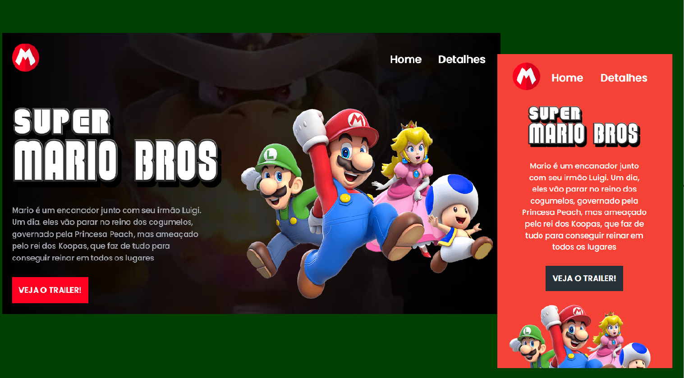

<h1 align="center"> Super Mario Bros - O Filme </h1>

  <a href="#-tecnologias">Tecnologias</a>&nbsp;&nbsp;&nbsp;|&nbsp;&nbsp;&nbsp;
  <a href="#-projeto">Projeto</a>&nbsp;&nbsp;&nbsp;

 

  

## 🚀 Tecnologias

Esse projeto foi desenvolvido com as seguintes tecnologias:

- HTML e CSS
- JavaScript
- Git e Github

## 💻 Projeto

Projeto desenvolvido no evento Semana do Zero ao Programador Contratado, disponibilizado pelo Dev em Dobro. Este projeto é uma Landing Page com informações a respeito do filme Super Mario Bros, que será lançado nos cinemas em Abril de 2023. Possui versão para Desktop e Mobile, e também um pop up para visualização do trailer do filme.
